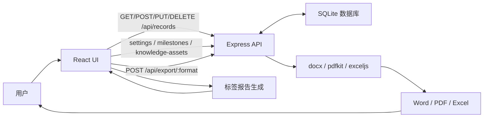

# 项目架构

本文档用于说明系统的代码结构、运行结构和数据流，帮助后续维护者快速判断功能应该放在哪一层。

文档边界：

- `README.md` 负责说明项目是什么、怎么运行、怎么构建。
- `PROJECT_ARCHITECTURE.md` 负责说明前后端分层、目录职责、数据流和部署结构。
- `REQUIREMENTS.md` 负责保存产品需求、任务清单和后续迭代计划。

## 总体架构

```text
浏览器
  ↓
React + Vite 前端
  ↓ /api
Express 后端
  ├─ SQLite：保存工作记录、配置、里程碑、知识资产
  └─ 导出服务：生成 Word / PDF / Excel
```

这是一个前后端分离系统：

- 前端负责页面、交互、报表展示、报告预览
- 后端负责记录、配置、里程碑、知识资产持久化，以及导出文件生成
- 数据库使用 SQLite，默认是一个文件：`backend/data/report.sqlite`

## 目录结构

```text
trace-work-report-system/
├─ package.json
├─ pnpm-workspace.yaml
├─ README.md
├─ PROJECT_ARCHITECTURE.md
├─ backend/
│  ├─ package.json
│  ├─ tsconfig.json
│  └─ src/
│     ├─ index.ts                # Express 入口、CRUD、导出路由
│     ├─ database.ts             # SQLite 初始化与记录、配置、成长数据读写
│     ├─ report.ts               # 标签分组、日期格式化、文件名处理
│     ├─ types.ts                # 后端共享类型
│     └─ exporters/
│        ├─ word.ts              # Word 导出
│        ├─ pdf.ts               # PDF 导出
│        └─ excel.ts             # Excel 导出
└─ frontend/
   ├─ package.json
   ├─ index.html
   ├─ vite.config.ts
   └─ src/
      ├─ App.tsx
      ├─ main.tsx
      ├─ styles.css
      ├─ constants.ts
      ├─ types.ts
      ├─ components/
      ├─ lib/
      │  ├─ recordsApi.ts        # 前端调用后端记录 API
      │  ├─ settingsApi.ts       # 分析权重、预警规则 API
      │  ├─ milestoneApi.ts      # 成长里程碑 API
      │  ├─ knowledgeApi.ts      # 知识资产 API
      │  ├─ growthReview.ts      # 复盘文本、预警和成长统计
      │  ├─ exportApi.ts         # 前端调用后端导出 API
      │  ├─ useRecords.ts        # 记录状态与服务端同步
      │  ├─ report.ts            # 标签报告生成
      │  ├─ records.ts           # 标签与记录工具函数
      │  ├─ date.ts              # 日期周期工具
      │  └─ storage.ts           # JSON 备份文本生成
      └─ pages/
         ├─ DailyPage.tsx
         ├─ WeeklyPage.tsx
         ├─ MonthlyPage.tsx
         ├─ YearlyPage.tsx
         ├─ GrowthPage.tsx
         ├─ KnowledgePage.tsx
         └─ AllRecordsPage.tsx
```

## 数据流



## 前端职责

- 渲染日报、周报、月报、年报、成长地图、知识资产库、全部记录页面
- 提供新增、编辑、删除、清空记录交互
- 通过 `/api/records` 与后端同步数据
- 按日期、周、月、年派生统计
- 按配置权重计算工作重心排行，按能力目标生成查漏补缺预警
- 维护成长里程碑和知识资产库
- 按二级标签生成报告预览
- 调用后端导出 Word、PDF、Excel
- 导出 JSON 备份文件

## 后端职责

- 提供记录、配置、里程碑、知识资产 CRUD API
- 使用 SQLite 保存记录和成长复盘相关数据
- 标准化二级标签
- 生成记录 ID、创建时间、更新时间
- 校验请求数据
- 生成 Word、PDF、Excel 下载文件，并附带分析规则、里程碑和知识资产复盘内容

## 数据存储

默认数据库文件：

```text
backend/data/report.sqlite
```

相关环境变量：

```text
DATA_DIR   # 数据目录
DB_PATH    # 完整数据库文件路径
PORT       # 后端端口，默认 4100
```

## 部署建议

云服务器部署推荐：

- `frontend/dist` 由 Nginx 托管
- 后端 `backend/dist/index.js` 用 PM2 启动
- Nginx 把 `/api/` 反向代理到 `127.0.0.1:4100`
- `backend/data/report.sqlite` 做定期备份
- 公网访问前增加登录或 Nginx Basic Auth
