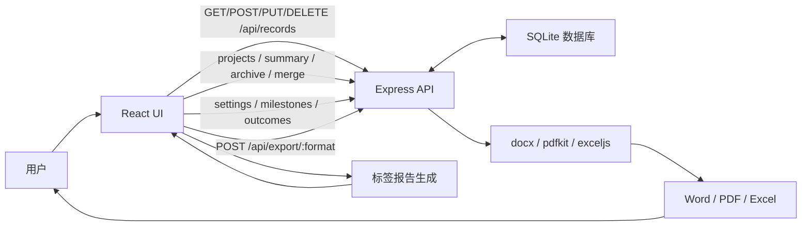

# 项目架构

本文档用于说明系统的代码结构、运行结构和数据流，帮助后续维护者快速判断功能应该放在哪一层。

文档边界：

- `README.md` 负责说明项目是什么、怎么运行、怎么构建。
- `PROJECT_ARCHITECTURE.md` 负责说明前后端分层、目录职责、数据流和部署结构。
- `REQUIREMENTS.md` 负责保存产品需求、任务清单和后续迭代计划。

## 总体架构

```text
浏览器
  ↓
React + Vite 前端
  ↓ /api
Express 后端
  ├─ SQLite：保存工作记录、项目与别名、成果关系、配置和里程碑
  └─ 导出服务：生成 Word / PDF / Excel
```

这是一个前后端分离系统：

- 前端负责页面、交互、报表展示、报告预览
- 后端负责记录、项目、成果、配置和里程碑持久化，以及导出文件生成
- 数据库使用 SQLite，默认是一个文件：`backend/data/report.sqlite`

## 目录结构

```text
trace-work-report-system/
├─ package.json
├─ pnpm-workspace.yaml
├─ README.md
├─ PROJECT_ARCHITECTURE.md
├─ backend/
│  ├─ package.json
│  ├─ tsconfig.json
│  └─ src/
│     ├─ index.ts                # Express 入口、CRUD、导出路由
│     ├─ database.ts             # SQLite 初始化与记录、配置、成长数据读写
│     ├─ report.ts               # 标签分组、日期格式化、文件名处理
│     ├─ types.ts                # 后端共享类型
│     └─ exporters/
│        ├─ word.ts              # Word 导出
│        ├─ pdf.ts               # PDF 导出
│        └─ excel.ts             # Excel 导出
└─ frontend/
   ├─ package.json
   ├─ index.html
   ├─ vite.config.ts
   └─ src/
      ├─ App.tsx
      ├─ main.tsx
      ├─ styles.css
      ├─ constants.ts
      ├─ types.ts
      ├─ components/
      │  ├─ LedgerRecordList.tsx # 紧凑台账、展开详情和多选交互
      ├─ lib/
      │  ├─ recordsApi.ts        # 前端调用后端记录 API
      │  ├─ projectApi.ts        # 项目生命周期、汇总和合并 API
      │  ├─ projectPresentation.ts # 项目搜索选项和历史项展示规则
      │  ├─ settingsApi.ts       # 分析权重、预警规则 API
      │  ├─ milestoneApi.ts      # 成长里程碑 API
      │  ├─ knowledgeApi.ts      # 旧知识资产只读兼容 API
      │  ├─ outcomeApi.ts        # 统一成果 API
      │  ├─ ledger.ts            # 台账组合筛选、范围统计与质量诊断纯函数
      │  ├─ recordImpactApi.ts   # 删除记录前读取项目与成果关联影响
      │  ├─ growthReview.ts      # 复盘文本、预警和成长统计
      │  ├─ exportApi.ts         # 前端调用后端导出 API
      │  ├─ useRecords.ts        # 记录状态与服务端同步
      │  ├─ report.ts            # 标签报告生成
      │  ├─ records.ts           # 标签与记录工具函数
      │  ├─ date.ts              # 日期周期工具
      │  └─ storage.ts           # JSON 备份文本生成
      └─ pages/
         ├─ DailyPage.tsx
         ├─ ProjectsPage.tsx
         ├─ WeeklyPage.tsx
         ├─ MonthlyPage.tsx
         ├─ YearlyPage.tsx
         ├─ GrowthPage.tsx
         ├─ KnowledgePage.tsx
         └─ AllRecordsPage.tsx
```

## 前端入口与页面组织

- `frontend/src/main.tsx` 挂载 React 应用。
- `frontend/src/App.tsx` 是当前真实应用入口，负责主导航、全局弹窗、toast、记录状态加载和页面切换。
- `frontend/src/components/Sidebar.tsx` 是当前侧边导航组件。
- `frontend/src/components/EditModal.tsx` 承载记录编辑弹窗，内部复用 `RecordForm`。
- `frontend/src/components/ReportDashboard.tsx` 承载周报、月报、年报中的核心数据展板。
- `frontend/src/pages/` 下按业务页面拆分：日报、项目管理、成果管理、周报、月报、年报、成长目标、全部记录、配置中心。
- `frontend/src/components/ProjectSelectField.tsx` 负责日报中的项目/非项目关系选择和快速新建。
- `frontend/src/components/ProjectEditor.tsx` 与 `ProjectMergeDialog.tsx` 复用项目编辑、合并预览和确认流程。

已经确认并清理的历史遗留组件：`Layout.tsx`、`EditRecordModal.tsx`、`Toast.tsx`。后续新增全局布局或 toast 时，应直接改造当前 `App.tsx` 和实际在用组件，避免重新引入并行实现。

## 数据流



## 前端职责

- 渲染日报、项目、成果、周报、月报、年报、成长目标和全部记录页面
- 提供新增、编辑、删除、清空记录交互
- 通过 `/api/records` 与后端同步数据
- 在工作台账中按时间、项目、业务、类型、产品、子任务、能力、系数来源、成果状态和质量问题组合筛选
- 从记录事实派生缺失字段、手动系数比例和疑似重复名称提醒；提醒不自动修改源数据
- 通过 `/api/projects` 维护项目实体、搜索别名、查看项目汇总并执行归档、恢复和合并
- 按日期、周、月、年派生统计
- 按配置权重计算工作重心排行，按能力目标生成查漏补缺预警
- 维护成长里程碑和统一成果证据
- 按二级标签生成报告预览
- 调用后端导出 Word、PDF、Excel
- 导出 JSON 备份文件

## 统计口径

当前报表统计以 `WorkRecord` 为基础数据源，前端在周期页面中按日期范围派生统计结果：

- 周报：按日聚合趋势。
- 月报：按周段聚合趋势。
- 年报：按月聚合趋势。
- 工作当量：优先使用记录中的 `workload`；当记录没有显式当量但有 `quantity` 和 `coefficient` 时，按 `quantity × coefficient` 补算。
- 投入时间：使用 `timeHours` 汇总，空值按 0 处理。
- 工作重心评分：默认按当量占比 50%、投入时间占比 30%、记录条数占比 20% 综合计算，权重来自配置中心。
- 能力维度：支持一条记录选择多个能力维度，统计时会拆分后参与能力分布和业务能力关联。
- 项目统计：按 `projectId` 建立稳定关系；`projectName` 作为不可变历史快照参与旧报表展示。
- 非项目事项：`projectRelation = non_project` 且 `projectId = null`；旧数据无法保守匹配时使用 `unassigned`。
- 业务与能力关联：业务分类来自 `businessCategory`，能力维度来自 `abilityDimension`。

这部分属于系统统计口径，后续调整图表或指标时应同步更新本节，避免 UI 和文档口径不一致。

## 后端职责

- 提供记录、项目、成果、配置和里程碑 CRUD API
- 提供记录删除影响预览，返回关联项目和成果，供前端二次确认
- 提供项目搜索、汇总、归档、恢复、合并预览和事务合并 API
- 使用 SQLite 保存记录和成长复盘相关数据
- 标准化二级标签
- 生成记录 ID、创建时间、更新时间
- 校验请求数据
- 生成 Word、PDF、Excel 下载文件，并附带分析规则、里程碑和成果清单

## 数据存储

默认数据库文件：

```text
backend/data/report.sqlite
```

相关环境变量：

```text
DATA_DIR   # 数据目录
DB_PATH    # 完整数据库文件路径
PORT       # 后端端口，默认 4100
```

项目数据由 `projects` 和 `project_aliases` 两张表负责。`records.projectId` 保存稳定关系，`records.projectRelation` 区分项目事项、非项目事项和历史未关联，`records.projectName` 保存写入时的名称快照。

迁移 `2026071401` 只对去除首尾空格后完全同名的历史项目名称做回填；空名称和无法精确匹配的内容保留为未关联，避免相似名称被错误合并。归档不会删除项目；恢复会回到进行中；合并在事务中迁移记录关联和别名，将来源项目标记为已归档并指向目标项目，同时不改写历史名称快照。

## 部署建议

云服务器部署推荐：

- `frontend/dist` 由 Nginx 托管
- 后端 `backend/dist/index.js` 用 PM2 启动
- Nginx 把 `/api/` 反向代理到 `127.0.0.1:4100`
- `backend/data/report.sqlite` 做定期备份
- 公网访问前增加登录或 Nginx Basic Auth
## Data Maintenance

Backup and archive logic lives under `backend/src/core/`. `backup.ts` wraps a full SQLite table snapshot in a compressed package and requires a restore preview before replacement. `yearArchive.ts` writes a year-scoped archive file under the data directory while leaving the working database unchanged. Workload-standard Excel import remains versioned and atomic: failed imports do not create partial standard versions.
